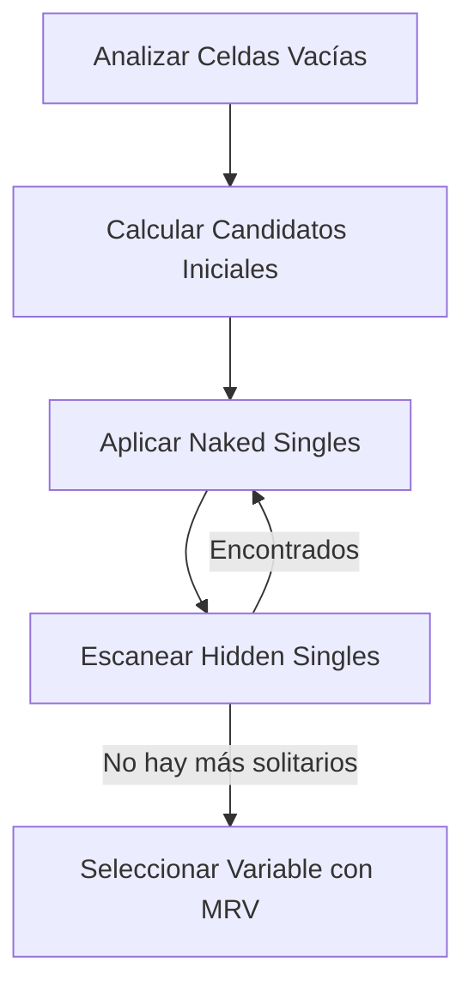
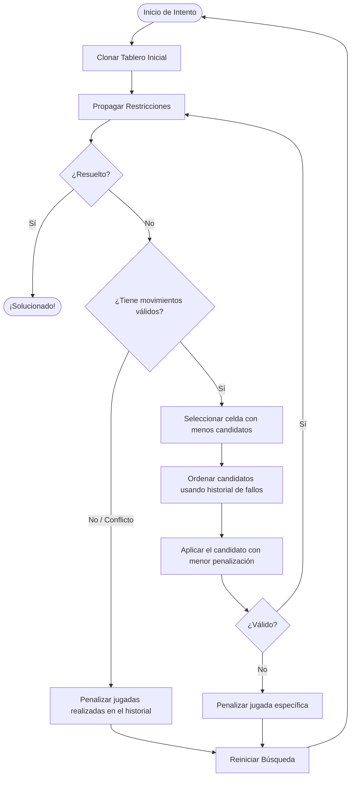

# Algoritmos del Sudoku Solver

Este documento contiene un análisis técnico detallado de los tres algoritmos diseñados e implementados en este resolvedor de Sudokus.

---

## Índice
1. [Introducción al Problema del Sudoku (CSP)](#introducción-al-problema-del-sudoku-csp)
2. [Propagación de Restricciones y Heurísticas Compartidas](#propagación-de-restricciones-y-heurísticas-compartidas)
   - [Naked Singles (Solitarios Desnudos)](#naked-singles-solitarios-desnudos)
   - [Hidden Singles (Solitarios Ocultos)](#hidden-singles-solitarios-ocultos)
   - [Mínimos Valores Restantes (MRV)](#mínimos-valores-restantes-mrv)
3. [Algoritmo 1: Tryouts (Reinicio Estocástico + Heurística de Historial)](#algoritmo-1-tryouts-reinicio-estocástico--heurística-de-historial)
4. [Algoritmo 2: Queue (Búsqueda Primero el Mejor - BFS Heurístico)](#algoritmo-2-queue-búsqueda-primero-el-mejor---bfs-heurístico)
5. [Algoritmo 3: Backtracking LDS (Búsqueda de Discrepancia Limitada Iterativa)](#algoritmo-3-backtracking-lds-búsqueda-de-discrepancia-limitada-iterativa)
6. [Resumen y Comparativa de Enfoques](#resumen-y-comparativa-de-enfoques)

---

## Introducción al Problema del Sudoku (CSP)
El Sudoku es un **Problema de Satisfacción de Restricciones (Constraint Satisfaction Problem - CSP)** clásico. Se define mediante:
- **Variables ($X$):** Las 81 celdas del tablero.
- **Dominios ($D$):** Los números del $\{1, 2, 3, 4, 5, 6, 7, 8, 9\}$ para cada celda vacía.
- **Restricciones ($C$):** Cada fila, columna y bloque de $3 \times 3$ debe contener los números del 1 al 9 exactamente una vez sin repeticiones.

Resolver un Sudoku mediante fuerza bruta pura requeriría explorar hasta $9^{81}$ estados en el peor de los casos. Por ello, la clave del éxito reside en la **propagación inteligente de restricciones** y en **heurísticas de ordenación de variables** que reduzcan el espacio de búsqueda.

---

## Propagación de Restricciones y Heurísticas Compartidas

Antes de tomar cualquier decisión de prueba y error, el resolvedor ejecuta una fase de deducción matemática compartida en la función helper `_getMoves()`.



### Naked Singles (Solitarios Desnudos)
Si al aplicar las restricciones básicas a una casilla vacía su lista de candidatos se reduce a **un único número**, ese número se asigna inmediatamente. Este cambio a su vez reduce los candidatos de sus 20 celdas vecinas (su fila, columna y subcuadrícula $3 \times 3$), lo que puede desencadenar nuevos solitarios en cadena. 

### Hidden Singles (Solitarios Ocultos)
Ocurre cuando, aunque una casilla tenga múltiples candidatos individuales disponibles, **un número concreto solo puede ir en una única posición dentro de toda una fila, columna o bloque de $3 \times 3$**. El resolvedor analiza cada unidad y, si detecta esta condición, asigna el número inmediatamente.

### Mínimos Valores Restantes (MRV)
Cuando las deducciones deterministas se agotan y es obligatorio ramificar (adivinar), el resolvedor aplica la heurística **MRV (Minimum Remaining Values)** o *Fail-First Principle*. Escoge siempre la casilla vacía que posea **la menor cantidad de candidatos posibles** (mayormente 2 o 3 candidatos).
- **¿Por qué?** Reduce el factor de ramificación del árbol de decisión y permite detectar contradicciones lo más rápido posible, minimizando el trabajo inútil.

---

## Algoritmo 1: Tryouts (Reinicio Estocástico + Heurística de Historial)

Este enfoque probabilístico está inspirado en la filosofía de los resolvedores SAT industriales (como CDCL) con aprendizaje dinámico. En lugar de mantener una recursión profunda, **aprende de sus errores y reinicia**.



### Mecánica Interna
1. **Historial de Fallos:** Mantiene un registro global indexado por la clave `"celda,valor"`, que cuenta cuántas veces esa asignación específica participó en un intento fallido de resolución.
2. **Selección por Reputación:** En cada paso de decisión, toma la celda seleccionada por MRV y ordena sus candidatos disponibles según su historial. **Prueba primero el candidato que haya fallado menos veces**.
3. **Reinicios Agresivos:** Si se produce un conflicto matemático (una celda se queda sin candidatos tras propagar):
   - Se penaliza la jugada actual.
   - Si colapsó todo el camino, se penalizan todas las decisiones intermedias tomadas.
   - El tablero se descarta por completo y se reinicia la resolución desde cero con el historial actualizado.

### Análisis
- **Ventajas:** Excelente para escapar de "trampas" de búsqueda profunda. Su adaptabilidad probabilística le permite resolver rompecabezas difíciles con muy pocos nodos explorados una vez que el historial de errores descarta los caminos incorrectos.
- **Desventajas:** Puede presentar una variabilidad de tiempos ligeramente mayor en rompecabezas extremadamente ambiguos (con muy pocas pistas iniciales).

---

## Algoritmo 2: Queue (Búsqueda Primero el Mejor - BFS Heurístico)

Es una búsqueda en grafo (Best-First Search) que explora el espacio de estados priorizando los tableros parciales más prometedores basándose en una función heurística.

### Mecánica Interna
1. **Representación de Agenda:** Una cola dinámica (`queue`) contiene todos los estados de tablero activos y válidos.
2. **Función de Evaluación (Score):** Cada estado se evalúa con una métrica donde los valores bajos indican un tablero más prometedor:
   $$\text{Score} = \text{Vacías} \times 10 + \text{Candidatos Totales} \times 10 + \text{Alternativas Usadas} \times 100000 + \text{Alternativas Creadas} \times 100$$
   - Se premia la cercanía a la meta (pocas vacías y pocos candidatos totales).
   - Se penaliza severamente el uso de "alternativas" lejanas a la recomendada por la heurística.
3. **Exploración:** En cada ciclo, la cola se ordena por Score. Se toma el mejor estado (`queue.shift()`), se genera un árbol de sucesores para la casilla con menos candidatos y se introducen de nuevo en la cola de búsqueda.

### Análisis
- **Ventajas:** Encuentra caminos directos y eficientes en Sudokus con estructuras lógicas moderadas. Evita el reinicio destructivo al conservar otros caminos activos en paralelo.
- **Desventajas:** Elevado consumo de memoria al clonar y almacenar decenas de tableros concurrentemente. Además, la ordenación repetida de la cola tiene un alto coste computacional.

---

## Algoritmo 3: Backtracking LDS (Búsqueda de Discrepancia Limitada Iterativa)

Este algoritmo representa una mejora sobresaliente sobre el DFS ordinario. Utiliza una técnica conocida en IA como **Limited Discrepancy Search (LDS)**.

### Mecánica Interna
1. **El Concepto de Discrepancia:** Cuando la heurística MRV ordena los candidatos de una celda de mejor a peor, elegir la primera opción (la mejor posicionada) tiene una discrepancia de $0$. Elegir la segunda opción tiene una discrepancia de $+1$, la tercera $+2$, etc.
2. **Iteraciones Controladas:** El algoritmo limita la cantidad de decisiones secundarias (discrepancias acumuladas) permitidas en una rama mediante un umbral `maxAlt` que incrementa iterativamente ($0, 1, 2, \dots$):
   ```javascript
   for (let maxAlt = 0; maxAlt <= MAX_DEPTH; maxAlt++) {
       const result = this._btRecurse(sudoku, maxAlt);
       if (result) return result;
   }
   ```
3. **Poda Temprana por Discrepancia:** En la recursión, si la suma de penalizaciones de las alternativas seleccionadas hasta el momento supera el umbral `maxAlt` permitido para esa iteración, la rama se poda de inmediato.

```
Nivel 0 (maxAlt = 0) ──> Solo toma la mejor opción en cada bifurcación (Búsqueda codiciosa)
Nivel 1 (maxAlt = 1) ──> Permite desviarse de la mejor opción en exactamente una casilla
Nivel 2 (maxAlt = 2) ──> Permite hasta dos decisiones secundarias o una decisión terciaria
```

### Análisis
- **Ventajas:** **Extremadamente eficiente en memoria.** Dispone del consumo mínimo y constante de un DFS convencional, pero con la inteligencia de exploración de un BFS, ya que explora primero los caminos con menor probabilidad de error (donde se siguen las heurísticas preferentes).
- **Desventajas:** Pequeño trabajo redundante al volver a visitar los niveles superficiales en cada incremento de `maxAlt`, aunque esto se compensa con creces gracias a las podas masivas en ramas profundas.

---

## Resumen y Comparativa de Enfoques

| Característica | Tryouts (Historial) | Queue (Best-First) | Backtracking (LDS) |
| :--- | :--- | :--- | :--- |
| **Tipo de Búsqueda** | Estocástica con Reinicios | Primero el Mejor (BFS) | DFS con Discrepancia |
| **Uso de Memoria** | Muy bajo (1 tablero activo) | Alto (múltiples tableros en cola) | Bajo (pila de recursión) |
| **Determinismo** | No (probabilístico) | Sí | Sí |
| **Ideal para...** | Tableros difíciles con patrones ocultos | Tableros estructurados con pistas uniformes | Tableros de extrema dificultad y alta ambigüedad |
| **Comportamiento ante fallos** | Reinicia y aprende del error | Regresa al siguiente mejor estado en cola | Retrocede respetando el límite de discrepancia |
