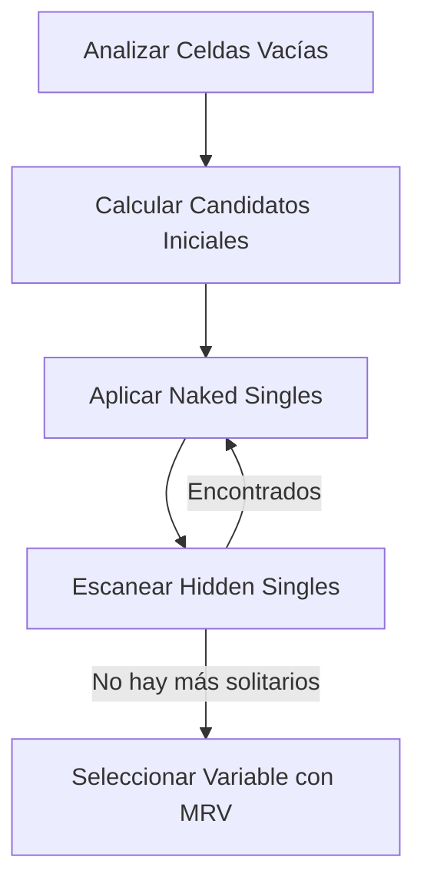
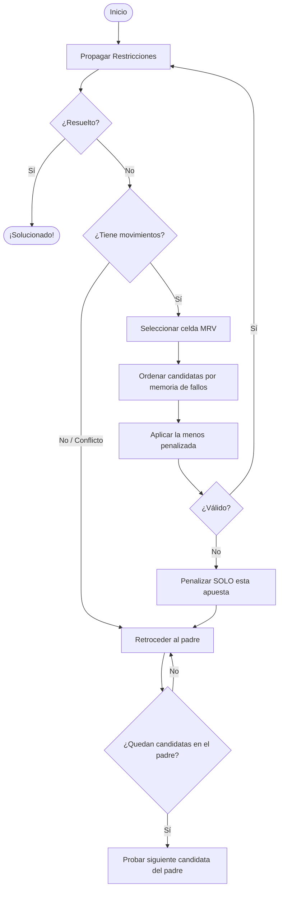

# Algoritmos del Sudoku Solver

Este documento contiene un análisis técnico detallado de los tres algoritmos diseñados e implementados en este resolvedor de Sudokus.

---

## Índice
1. [Introducción al Problema del Sudoku (CSP)](#introducción-al-problema-del-sudoku-csp)
2. [Propagación de Restricciones y Heurísticas Compartidas](#propagación-de-restricciones-y-heurísticas-compartidas)
   - [Naked Singles (Solitarios Desnudos)](#naked-singles-solitarios-desnudos)
   - [Hidden Singles (Solitarios Ocultos)](#hidden-singles-solitarios-ocultos)
   - [Mínimos Valores Restantes (MRV)](#mínimos-valores-restantes-mrv)
3. [Algoritmo 1: Backtracking (failure-memory)](#algoritmo-1-backtracking-failure-memory)
4. [Algoritmo 2: Queue (Búsqueda Primero el Mejor - BFS Heurístico)](#algoritmo-2-queue-búsqueda-primero-el-mejor---bfs-heurístico)
5. [Algoritmo 3: Backtracking LDS (Búsqueda de Discrepancia Limitada Iterativa)](#algoritmo-3-backtracking-lds-búsqueda-de-discrepancia-limitada-iterativa)
6. [Optimización opcional: tabla de transposición / branch-and-bound](#optimización-opcional-tabla-de-transposición--branch-and-bound)
7. [Resumen y Comparativa de Enfoques](#resumen-y-comparativa-de-enfoques)

---

## Introducción al Problema del Sudoku (CSP)
El Sudoku es un **Problema de Satisfacción de Restricciones (Constraint Satisfaction Problem - CSP)** clásico. Se define mediante:
- **Variables ($X$):** Las 81 celdas del tablero.
- **Dominios ($D$):** Los números del $\{1, 2, 3, 4, 5, 6, 7, 8, 9\}$ para cada celda vacía.
- **Restricciones ($C$):** Cada fila, columna y bloque de $3 \times 3$ debe contener los números del 1 al 9 exactamente una vez sin repeticiones.

Resolver un Sudoku mediante fuerza bruta pura requeriría explorar hasta $9^{81}$ estados en el peor de los casos. Por ello, la clave del éxito reside en la **propagación inteligente de restricciones** y en **heurísticas de ordenación de variables** que reduzcan el espacio de búsqueda.

---

## Propagación de Restricciones y Heurísticas Compartidas

Antes de tomar cualquier decisión de prueba y error, el resolvedor ejecuta una fase de deducción matemática compartida en la función helper `_getMoves()`.



### Naked Singles (Solitarios Desnudos)
Si al aplicar las restricciones básicas a una casilla vacía su lista de candidatos se reduce a **un único número**, ese número se asigna inmediatamente. Este cambio a su vez reduce los candidatos de sus 20 celdas vecinas (su fila, columna y subcuadrícula $3 \times 3$), lo que puede desencadenar nuevos solitarios en cadena.

### Hidden Singles (Solitarios Ocultos)
Ocurre cuando, aunque una casilla tenga múltiples candidatos individuales disponibles, **un número concreto solo puede ir en una única posición dentro de toda una fila, columna o bloque de $3 \times 3$**. El resolvedor analiza cada unidad y, si detecta esta condición, asigna el número inmediatamente.

### Mínimos Valores Restantes (MRV)
Cuando las deducciones deterministas se agotan y es obligatorio ramificar (adivinar), el resolvedor aplica la heurística **MRV (Minimum Remaining Values)** o *Fail-First Principle*. Escoge siempre la casilla vacía que posea **la menor cantidad de candidatos posibles** (mayormente 2 o 3 candidatos).
- **¿Por qué?** Reduce el factor de ramificación del árbol de decisión y permite detectar contradicciones lo más rápido posible, minimizando el trabajo inútil.

---

## Algoritmo 1: Backtracking (failure-memory)

> **Nota histórica:** La primera versión de este algoritmo era un *reinicio estocástico con historial global* que penalizaba todas las jugadas de cada intento fallido. Eso resultó **incompleto** en los sudokus más difíciles: al penalizar también las jugadas forzadas y las apuestas tempranas correctas, el historial aprendía a *evitar* decisiones válidas y el solver no convergía ni con miles de reinicios. Esa versión original se conserva en el repositorio como algoritmo de referencia **`tryoutsStochastic`** (seleccionable en la demo) precisamente para ilustrar la diferencia. La versión actual (descrita aquí) corrige el defecto convirtiéndose en **backtracking en profundidad con memoria de fallos**, renombrada como **Backtracking (failure-memory)**.



### Mecánica Interna
1. **Solo se "apuesta" en puntos de bifurcación:** El algoritmo toma una decisión de prueba y error **exclusivamente** en celdas con varios candidatos (MRV). Las jugadas forzadas (Naked/Hidden Singles) son consecuencia determinista de la propagación y **nunca** forman parte de las apuestas.
2. **Orden por memoria de fallos:** En cada bifurcación, las candidatas de la celda se ordenan según un historial global indexado por la clave `"celda,valor"`. Se prueba primero la candidata que ha fallado menos veces.
3. **Backtracking recursivo con propagación de fallo:** Se explora en profundidad. Si una candidata conduce a contradicción, se **retrocede al padre** y se prueba su siguiente candidata. Cuando una celda agota *todas* sus candidatas, el fallo se propaga automáticamente al padre (retorno `null` de la recursión). Como por definición del Sudoku **toda celda debe tener un valor válido**, una celda agotada implica que el prefijo (las decisiones anteriores) es inconsistente; por tanto, la culpa sube al padre. No se necesita CDCL ni cláusulas de conflicto para mantener la completitud.
4. **Penalización quirúrgica:** Solo se penaliza la **apuesta concreta fallida** `(celda, valor)`, nunca el camino completo ni las jugadas forzadas. La penalización es una *pista suave de ordenación*, no una prohibición: una candidata que falló en un prefijo se vuelve a intentar más tarde en otro contexto, por lo que la búsqueda sigue siendo **completa** (siempre resuelve un Sudoku resoluble).

### Análisis
- **Ventajas:** Completo y muy eficiente. Resuelve los sudokus conocidos más difíciles (conjuntos *top20*, *top1465*, *17-clue*) en unas pocas decenas a pocos cientos de "intentos de bifurcación" y menos de ~3 ms de media. Memoria baja (pila de recursión + clónicos de rama).
- **Desventajas:** Determinista (no aprovecha aleatoriedad), aunque la memoria de fallos aporta el sesgo de "evitar lo que ya sé que no funciona".

---

## Algoritmo 2: Queue (Búsqueda Primero el Mejor - BFS Heurístico)

Es una búsqueda en grafo (Best-First Search) que explora el espacio de estados priorizando los tableros parciales más prometedores basándose en una función heurística.

### Mecánica Interna
1. **Representación de Agenda:** Una cola dinámica (`queue`) contiene todos los estados de tablero activos y válidos.
2. **Función de Evaluación (Score):** Cada estado se evalúa con una métrica donde los valores bajos indican un tablero más prometedor:
   $$\text{Score} = \text{Vacías} \times 10 + \text{Candidatos Totales} \times 10 + \text{Alternativas Usadas} \times 100000 + \text{Alternativas Creadas} \times 100$$
   - Se premia la cercanía a la meta (pocas vacías y pocos candidatos totales).
   - Se penaliza severamente el uso de "alternativas" lejanas a la recomendada por la heurística.
3. **Exploración:** En cada ciclo, la cola se ordena por Score. Se toma el mejor estado (`queue.shift()`), se genera un árbol de sucesores para la casilla con menos candidatos y se introducen de nuevo en la cola de búsqueda.

### Análisis
- **Ventajas:** Encuentra caminos directos y eficientes en Sudokus con estructuras lógicas moderadas. Evita el reinicio destructivo al conservar otros caminos activos en paralelo.
- **Desventajas:** Consumo de memoria **moderado**: mantiene varios tableros vivos en la cola, pero en la práctica el pico de estados concurrentes es comparable a la profundidad de recursión del backtracking (el árbol de Sudoku es estrecho, ver benchmark). La ordenación repetida de la cola tiene un coste computacional algo mayor que el DFS puro.

---

## Algoritmo 3: Backtracking LDS (Búsqueda de Discrepancia Limitada Iterativa)

Este algoritmo representa una mejora sobresaliente sobre el DFS ordinario. Utiliza una técnica conocida en IA como **Limited Discrepancy Search (LDS)**.

### Mecánica Interna
1. **El Concepto de Discrepancia:** Cuando la heurística MRV ordena los candidatos de una celda de mejor a peor, elegir la primera opción (la mejor posicionada) tiene una discrepancia de $0$. Elegir la segunda opción tiene una discrepancia de $+1$, la tercera $+2$, etc.
2. **Iteraciones Controladas:** El algoritmo limita la cantidad de decisiones secundarias (discrepancias acumuladas) permitidas en una rama mediante un umbral `maxAlt` que incrementa iterativamente ($0, 1, 2, \dots$):
   ```javascript
   for (let maxAlt = 0; maxAlt <= MAX_DEPTH; maxAlt++) {
       const result = this._btRecurse(sudoku, maxAlt);
       if (result) return result;
   }
   ```
3. **Poda Temprana por Discrepancia:** En la recursión, si la suma de penalizaciones de las alternativas seleccionadas hasta el momento supera el umbral `maxAlt` permitido para esa iteración, la rama se poda de inmediato.

```
Nivel 0 (maxAlt = 0) ──> Solo toma la mejor opción en cada bifurcación (Búsqueda codiciosa)
Nivel 1 (maxAlt = 1) ──> Permite desviarse de la mejor opción en exactamente una casilla
Nivel 2 (maxAlt = 2) ──> Permite hasta dos decisiones secundarias o una decisión terciaria
```

### Análisis
- **Ventajas:** **Extremadamente eficiente en memoria.** Dispone del consumo mínimo y constante de un DFS convencional, pero con la inteligencia de exploración de un BFS, ya que explora primero los caminos con menor probabilidad de error (donde se siguen las heurísticas preferentes).
- **Desventajas:** Pequeño trabajo redundante al volver a visitar los niveles superficiales en cada incremento de `maxAlt`, aunque esto se compensa con creces gracias a las podas masivas en ramas profundas.

---

## Optimización opcional: tabla de transposición / branch-and-bound

*Mejora pendiente de cablear al código; se documenta aquí como optimización opcional para Tryouts (y, en general, para cualquier algoritmo de búsqueda del solver).*

La idea (análoga a las **tablas hash de los motores de ajedrez**) es no recorrer dos veces un mismo subproblema:

1. **Clave de estado:** Se calcula un *hash* del tablero parcial (por ejemplo, la cadena de 81 celdas o una huella más compacta de celdas ocupadas + candidatos).
2. **Valor cacheado:** Para esa clave se guarda el **número de celdas restantes** (o una cota inferior del trabajo necesario para completarlo) observado hasta el momento.
3. **Poda por cota:** Al entrar en un estado, si su número de celdas restantes es **igual o peor** que el ya registrado para esa clave, se descarta la rama (no puede mejorar lo ya visto). De este modo solo se profundiza cuando se promete un camino más corto.
4. **Alcance de la penalización:** Estas celdas "penalizadas/marcadas" **no deben influir en los *singles*** (jugadas forzadas) — solo se usan para **priorizar en los momentos de bifurcación** (ordenar candidatas en celdas MRV), nunca para invalidar deducciones deterministas.

*Caveat:* en Sudoku hay muchas menos transposiciones que en ajedrez (el árbol de búsqueda es más lineal y los estados rara vez se repiten por caminos distintos), así que el golpe de cache es menor que en un motor de ajedrez. La métrica "celdas restantes" además es una cota gruesa (dos estados con igual número de huecos pueden diferir mucho en dificultad), por lo que esta optimización conviene como poda secundaria **encima** del backtracking + memoria de fallos, no como reemplazo.

---

## Resumen y Comparativa de Enfoques

| Característica | Backtracking (failure-memory) | Queue (Best-First) | Backtracking (LDS) |
| :--- | :--- | :--- | :--- |
| **Tipo de Búsqueda** | DFS con memoria de fallos (penalización de apuesta concreta) | Primero el Mejor (BFS) | DFS con Discrepancia |
| **Uso de Memoria** | Bajo (pila de recursión + clónicos de rama) | Moderado (estados concurrentes ≈ profundidad DFS en la práctica) | Bajo (pila de recursión) |
| **Determinismo** | Sí | Sí | Sí |
| **Completitud** | Sí (resuelve cualquier Sudoku resoluble) | Sí | Sí |
| **Ideal para...** | Cualquier Sudoku, incluidos los más difíciles | Tableros estructurados con pistas uniformes | Tableros de extrema dificultad y alta ambigüedad |
| **Comportamiento ante fallos** | Retrocede al padre y prueba la siguiente candidata; penaliza la apuesta concreta fallida | Regresa al siguiente mejor estado en cola | Retrocede respetando el límite de discrepancia |
