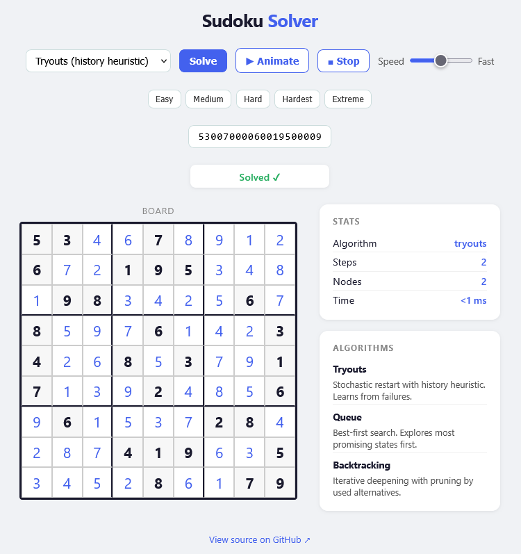

# Sudoku Solver JS

Interactive Sudoku solver in vanilla JavaScript with step-by-step animation.

**[Live demo](https://mcarbonell.github.io/sudoku-solver-js)**



## Features

- 4 algorithms: Backtracking (failure-memory), Tryouts Stochastic (baseline), Queue, Backtracking (LDS)
- Step-by-step animation with speed control
- 5 built-in puzzles (Easy → Extreme)
- Paste any 81-digit puzzle
- No dependencies — plain HTML/CSS/JS

## Algorithms

For a detailed technical explanation of the mathematical and computer science principles behind these algorithms, check out [ALGORITHMS.md](ALGORITHMS.md) (in Spanish).

### Backtracking (failure-memory) (default)
Depth-first backtracking with a failure-memory heuristic. It branches only at
MRV cells and, on a dead end, backtracks to the parent and penalizes **only the
concrete failed guess** (never the forced moves). Always finds a solution when one
exists; it solves the hardest known puzzles in a few hundred branching attempts.
This is the corrected version of the original "Tryouts" algorithm (see below).

### Tryouts Stochastic (baseline)
The **original** Tryouts design, kept as a reference. It restarts from scratch on
every failed attempt and penalizes the *entire* move history (including forced
moves and correct early guesses). That contamination makes it **incomplete** on
hard puzzles — it solves only ~7/20 of the top-20 set — which is exactly why it was
replaced. Selectable in the demo to illustrate the difference.

### Queue
Best-first search over board states scored by a heuristic. Explores the most
promising states first without restarting.

### Backtracking
Iterative deepening with pruning by number of used alternatives (LDS). Increases
the allowed branching limit on each iteration until a solution is found.

## Benchmark

The three complete algorithms solve **100%** of a 270-puzzle suite (Top 20, Top 100,
17-clue, Subig 20 and OpenSudoku Very Hard). Summary on the hardest set
(Top 20) and globally:

| Algorithm | Solved | Avg nodes (global) | Time (Top 20) | Peak live states (mem) |
|-----------|--------|--------------------|---------------|------------------------|
| Backtracking (failure-memory) | 100% | 49       | 1.9 ms        | ~12 (DFS depth)        |
| Queue     | 100%   | 36                 | 1.8 ms        | ~8 (queue length)      |
| Backtracking (LDS) | 100% | 158          | 4.7 ms        | ~11 (DFS depth)        |

> The 4th algorithm, **Tryouts Stochastic (baseline)**, is intentionally left
> incomplete (~7/20 on the top-20 set) — it is the original design kept for comparison.

- **Queue** explores the fewest branching attempts.
- **Backtracking (failure-memory)** is fastest on the hardest puzzles, with minimal memory.
- **Memory is light in all three**: a Sudoku search tree is narrow, so Queue's
  live states stay comparable to the backtracking recursion depth (not "high").

## Usage

No build step needed. Open `index.html` with any local server:

```bash
npx serve .
# or
python -m http.server 8080
```

Then open `http://localhost:8080`.

> ES modules require a server — opening `index.html` directly via `file://` won't work.

## Project structure

```
sudoku-solver-js/
├── src/
│   ├── Sudoku.js        # Board state, candidates, constraint propagation
│   └── SudokuSolver.js  # Three algorithms with step recording
├── css/
│   └── style.css
├── app.js               # UI, animation, presets
└── index.html
```

## Related

- [sudoku-solver-php](https://github.com/mcarbonell/sudoku-solver-php) — original PHP implementation

## License

MIT — see [LICENSE](LICENSE)
